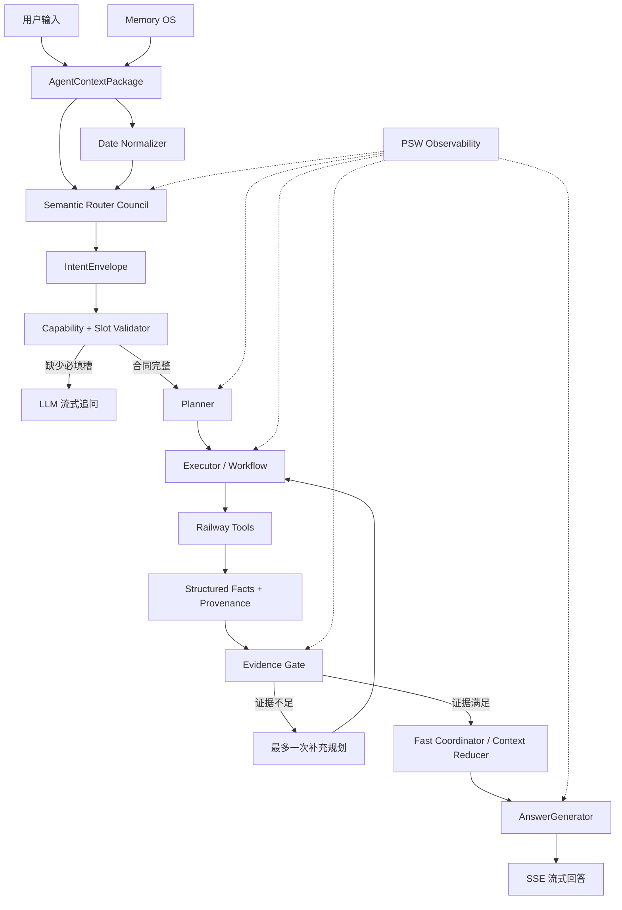
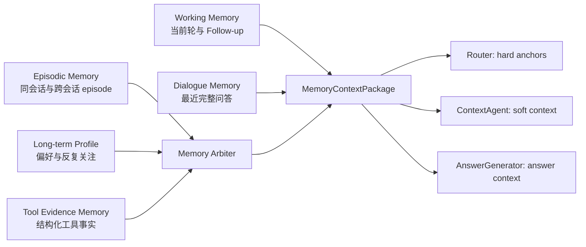

# RailGPT

<p align="center">
  
</p>

<p align="center">
  <a href="https://github.com/EasonWheng/RailGPT/releases/tag/v2.6.6">
    
  </a>
  <a href="https://github.com/EasonWheng/RailGPT/releases">
    
  </a>
  <a href="https://github.com/EasonWheng/RailGPT/stargazers">
    
  </a>
  <a href="https://github.com/EasonWheng/RailGPT/blob/main/LICENSE">
    
  </a>
  
  
</p>

<p align="center">
  <strong>面向中国铁路真实咨询场景的本地优先、多 Agent、工具证据驱动 AI 应用。</strong><br/>
  <strong>A local-first, multi-agent railway assistant grounded in structured tools and verifiable evidence.</strong>
</p>

<p align="center">
  <strong>简体中文</strong> ·
  <a href="./README_EN.md">English Documentation</a> ·
  <a href="#english-overview">English Overview</a> ·
  <a href="https://github.com/EasonWheng/RailGPT/releases/tag/v2.6.6">下载安装包 / Download</a> ·
  <a href="https://github.com/EasonWheng/RailGPT/issues">Issues</a>
</p>

---

## 中文说明

RailGPT 不是一个只靠大模型先验知识“猜火车”的聊天机器人。它把自然语言理解、铁路专业工具、上下文工程、分层记忆、缓存与网络保护、事实校验、流式生成和桌面应用整合在同一条可观测执行链中。

当用户询问车次路径、经停历史、动车组担当、站到站列车、实时余票、正晚点、车站大屏或检票口信息时，系统会先识别对应的能力合同，再调用最小且精确的工具，最后让 LLM 只基于已经获取的事实组织回答。对于铁路原理、历史、文化、旅行灵感、创作和普通对话，则进入上下文对话链，不强行要求出发站、到达站或日期。

> [!IMPORTANT]
> RailGPT 是信息咨询与铁路分析工具。项目现在和未来都不会提供自动抢票、刷票、绕过 12306 风控、批量爬取或其他违规购票功能。

> [!NOTE]
> 当前可下载的桌面发行版仍为 **v2.6.6**。`main` 分支中的 Router、Context、Memory 和 Tool Contract 已完成大规模升级，处于 **v3 preview / release candidate** 阶段。这里的“v3 preview”描述 Agent 架构代际，不代表已经发布了 `v3.0.0` 安装包。

## 目录

- [项目现状](#项目现状)
- [最近三个月发生了什么](#最近三个月发生了什么)
- [设计原则](#设计原则)
- [当前能力](#当前能力)
- [能力合同与缺槽策略](#能力合同与缺槽策略)
- [Agent 架构](#agent-架构)
- [上下文与日期工程](#上下文与日期工程)
- [Memory OS](#memory-os)
- [数据源、网络保护与缓存](#数据源网络保护与缓存)
- [模型与运行模式](#模型与运行模式)
- [Fast 模式事实压缩](#fast-模式事实压缩)
- [桌面端与前端体验](#桌面端与前端体验)
- [隐私与安全](#隐私与安全)
- [安装与运行](#安装与运行)
- [开发与测试](#开发与测试)
- [仓库结构](#仓库结构)
- [当前边界](#当前边界)
- [版本策略与路线图](#版本策略与路线图)
- [参与开发](#参与开发)
- [致谢](#致谢)

## 项目现状

| 项目 | 当前状态 |
| --- | --- |
| 桌面发行版本 | `v2.6.6` |
| 主分支架构状态 | `v3 preview / RC` |
| 主要运行平台 | Windows 10/11 x64 |
| 桌面技术栈 | Flask + HTML/CSS/JavaScript + pywebview |
| 桌面回退 | pywebview 启动失败时自动打开系统浏览器 |
| 默认地址 | `127.0.0.1:5033`，端口冲突时自动寻找空闲端口 |
| LLM 服务 | DeepSeek，OpenAI-compatible 请求格式 |
| Agent 模式 | `FAST-GO`、`FAST-PLUS`、`DEEP` |
| 数据存储 | SQLite + JSON/JSONL + 本地文件 |
| API Key 存储 | Windows DPAPI，加密后保存在当前用户 AppData |
| 对话输出 | SSE 流式文本 + Thinking/PSW 观察流 |
| 最新测试基线 | 382 项单元测试通过 |
| 使用定位 | 单用户、本地桌面、铁路信息咨询与研究分析 |

当前系统已经形成完整闭环：

```text
用户输入
  -> 上下文构建
  -> 日期解析
  -> 多 Agent 语义路由
  -> 能力合同与槽位校验
  -> 规划与工具执行
  -> 证据门禁
  -> 事实压缩
  -> LLM 流式回答
  -> 会话与 Memory 持久化
```

## 最近三个月发生了什么

### Router 从词表分流升级为语义协作

- 从大量局部 `_looks_like_*` 和扁平 flags 迁移到 `Semantic Router Council`。
- 引入 continuation、tool-intent、chat-knowledge 等轻量语义代理。
- 建立 `IntentEnvelope`，让 Router、Planner、Executor 和 AnswerGenerator 共享同一个结构化意图。
- 确定性代码不再承担主语义理解，只保留能力门禁、显式槽优先级与事实安全校验。

### 工具能力从“散落提示词”升级为统一注册表

- 建立 MCP 风格 `ToolCapabilityRegistry`。
- 每项能力声明 required slots、optional slots、defaults、temporal scope、evidence、workflow、cost 和 availability。
- 明确区分路径、余票、晚点、站台、担当、站到站、知识解释等不同能力边界。
- 暂时下线的能力会显式标记为 disabled，不允许 Router 用其他工具假装完成。

### 上下文链路完成统一

- 引入 `AgentContextPackage`。
- Router、ContextAgent、DateAgent 和 AnswerGenerator 不再各自截取最近两条消息。
- 三种模式按不同预算读取对话，但都保留最近完整问答。
- ContextAgent 收窄为省略指代补全器，不再成为整个前级理解链的单点故障。

### 日期问题得到专门治理

- 新增 LLM Date Normalizer。
- 用户本轮显式日期永远高于旧上下文、Memory 和默认“今天”。
- `FAST-PLUS` 与 `DEEP` 的复杂日期只允许由 LLM 解析，代码只做结构验收和优先级保护。
- 修复“用户输入 5 月 5 日，ContextAgent 却把日期改成今天”的历史问题。

### Memory 从锚点桶升级为 Memory OS

- Working、Dialogue、Episodic、Long-term Profile、Tool Evidence 分层。
- 候选召回与硬槽采用两阶段仲裁。
- Assistant 生成文本不能反向污染 train、route、date。
- Long-term Profile 永远 soft-only。
- 采用重要性积分，避免每次对话都写入长期记忆。

### 数据访问更加克制和可审计

- 维护 RailGo v1/v2 兼容链路。
- 所有 RailGo 请求带 RailGPT 身份头与匿名 installation UUID。
- 本地数据库和有效证书优先，失效后才访问网络。
- 车站大屏、当前晚点、检票口/站台/出站口增加针对性 SQLite 缓存。
- 继续保留低连接数、低频率、single-flight 和截断二进制指数退避。

### 桌面产品完成设置化

- API Key 从源码移除，改由 Settings 管理。
- Windows 下使用 DPAPI 加密。
- 支持主 API Key 与 Thinker API Key。
- pywebview 桌面优先，失败自动浏览器回退。
- 默认端口 `5033`，冲突时自动避让。
- Web 与 pywebview 均支持 Markdown 导出。

## 设计原则

### 1. 工具证据优先

如果用户问题落在已注册的专业能力范围内，RailGPT 必须先调用工具，再让模型表达。模型记忆不能替代实时或结构化证据。

例如：

- “G20 最近几天用什么动车组？”调用担当历史工具。
- “G1 最早是不是只停南京南？”调用停站历史工具。
- “请用 12306 验证商务座是否售罄。”调用实时余票工具。
- “G813 今天晚点了吗？”调用当前正晚点工具，不能用图定时刻推断。
- “北京哪个火车站是京广高铁的车站？”进入铁路知识解释，不应误触发票务缺槽。

### 2. 每项能力拥有独立合同

RailGPT 不采用“所有铁路问题都必须提供 OD”的全局规则。

- 实时余票需要 `出发地 + 到达地 + 日期`。
- 当前晚点只需要 `车次`，OD 只是可选展示范围。
- 车站大屏只需要 `车站`，方向默认出发。
- 检票口/站台信息需要 `车次 + 车站`，日期默认当天、方向默认出发。
- 单车次综合介绍只需要 `车次`，工作流可并行查询路径和近期担当。
- 普通知识、社交回复、旅行与创作不进入铁路查询缺槽模板。

### 3. 本轮显式事实优先

```text
本轮用户显式输入
  > 本轮工具事实
  > 有效 follow-up contract
  > 当前会话可靠上下文
  > episodic 候选
  > long-term soft profile
  > assistant 生成文本
```

用户本轮明确输入的 `2026-05-05`、`G20` 或 `南京南` 不得被旧日期、旧路线或模型改写覆盖。

### 4. 正确的工具还不够，还需要正确的证据

RailGPT 通过 Evidence Gate 检查工具返回是否真正满足用户意图：

- `train_delay` 不能由 `path_detail` 满足。
- `left_ticket_s2s` 不能由普通运行图满足。
- `path_stopcheck` 不能只靠站到站列表替代。
- `smartemu_analysis` 不能用车型常识替代真实担当记录。
- 标杆评级必须来自 `s2s_benchmark`，不能由模型自行定义。

### 5. 可观测，而不是黑箱等待

PSW（Program Status Word）状态流展示：

- Memory recall / curate / arbitrate；
- routing / capability routing；
- planning / workflow step；
- querying / in-flight；
- cache hit / miss / expired；
- retry / backoff；
- evidence mismatch；
- fast reducing / merging / RAG；
- generating / done / error。

## 当前能力

### 车次与动车组

| 能力 | 典型问题 | 工具或工作流 |
| --- | --- | --- |
| 单车次近期担当 | G20 最近几天用的什么车？ | `train` |
| 动车组近期交路 | CR400BF-5033 最近跑什么车次？ | `emu` |
| 多车次智能动车分析 | 分析 G7、G20、G33 的智能动车使用情况 | `smartemu_analysis` |
| 单车次综合画像 | 详细介绍 G311，它有什么特点？ | `train_overview = path_detail + train` |
| 指定线路智能动车搜索 | 上海虹桥到北京南哪些车常用 AFZ？ | `route_smartemu_search = s2s + smartemu` |

动车组担当与交路历史主要来自 `rail.re` 体系。模型只能根据工具记录说明近期使用、频率、最新观测和可能性，不能把历史记录包装成尚未获得证据的当日调度事实。

### 路径、时刻与停站

| 能力 | 说明 |
| --- | --- |
| `path_detail` | 当前或指定日期的单车次始终站、经停站、图定时刻和路径 |
| `path_future` | 明确未来日期的单车次路径 |
| `path_past` | 明确历史日期的单车次路径 |
| `path_stopcheck` | 多车次 × 多车站停站矩阵与历史核验 |

典型问题：

- “G20 的完整路线是什么？”
- “G1 最早是不是只停南京南一站？”
- “G1 是什么时候开始加停济南西或天津南的？”
- “G71 和 G73 实际终点在哪里，停站有什么不同？”

`path_detail` 只提供图定路径和时刻，不能替代实时晚点、站台或余票证据。

### 站到站查询与筛选

| 能力 | 用途 |
| --- | --- |
| `station_to_station_mini` | 推荐型、压缩后的 OD 车次列表 |
| `station_to_station_detail` | 用户明确要求全量时使用 |
| `station_to_station_future` | 明确未来日期的 OD 列车 |
| `station_to_station_past` | 历史日期的 OD 列车 |
| `s2s_benchmark` | 工具评级最快或标杆候选 |
| `s2s_timeband_dep` | 按出发时间段筛选 |
| `s2s_timeband_arr` | 按到达时间段筛选 |
| `s2s_regular_only` | 只看图定常规列车 |
| `s2s_temporary_only` | 只看临时旅客列车 |
| `s2s_bureau_filter` | 按担当铁路局/集团筛选 |
| `route_train_benchmark` | 核验指定车次在 OD 上是否属于工具评级候选 |

RailGo 的运行图数据具有季度特征。RailGPT 保留日期尝试、证书和本地数据库逻辑，以兼顾图定列车、阶段性停运和临客发现，同时限制外部请求数量。

### 12306 实时客运信息

| 能力 | 必填信息 | 说明 |
| --- | --- | --- |
| `left_ticket_s2s` | 出发地、到达地、日期 | 查询官方实时余票，可限定车次 |
| `transfer_12306` | 出发地、到达地、日期 | 查询两段式中转，可指定中转站 |

保护策略：

- SQLite 查询缓存；
- 证书状态缓存；
- 相同请求 single-flight 合并；
- live query 窗口限额；
- 网络或证书失败时受控降级；
- 禁止循环刷票式调用。

RailGPT 只负责信息查询和方案展示，不执行购票。

### 车站与模糊检索

| 能力 | 典型问题 |
| --- | --- |
| `telecode` | 南京南的三字码是什么？ |
| `name` | NKH 是哪个车站？ |
| `station` | 南京南属于哪个铁路局、哪个城市？ |
| `station_preselect` | 只记得站名一部分，帮我找候选车站 |
| `train_preselect` | 只记得不完整车次号，帮我找候选车次 |
| `random_train` | 随机推荐一趟车给我研究 |

精确站名和三字码优先使用项目内置字典。只有用户明确要求模糊搜索时才调用预选词服务，避免昂贵且不必要的外部请求。

### RailGo v2 实时运营

| 能力 | 必填信息 | 默认值 | 本地缓存 |
| --- | --- | --- | --- |
| `train_delay` | 车次 | OD/车站可选 | 15 分钟，且不跨北京时间午夜 |
| `train_station_access` | 车次、车站 | 当天、出发方向 | 抓取当天 24:00 前有效 |
| `station_board` | 车站 | 出发大屏 | 5 分钟，且不跨北京时间午夜 |

晚点工作流边界：

1. 只给车次时，可先查路径建立完整站序，再查当前正晚点。
2. 给出 OD 时，RailGo 仍按车次查询，Agent 在本地截取用户区间。
3. 过去或未来的“晚点”不能用当前接口回答。
4. 图定路径或“没有异常提示”都不能推导“没有晚点”。
5. 实时缓存过期且刷新失败时，不把旧数据伪装为当前状态。

### 普通知识、旅行与创作

RailGPT 同样支持不需要工具的自然对话：

- 铁路工程原理、线路标准、道岔、隧道耳压；
- 铁路历史、文化、车型知识和车迷讨论；
- 城市旅行灵感与行程建议；
- 基于上一轮内容继续写作、改文风或扩写；
- “所以为什么会有这么多车”“那它呢”“继续写”“是的”等上下文承接。

这类问题由语义 Router 识别为 chat，不进入统一 OD 缺槽模板。

## 能力合同与缺槽策略

能力注册表位于 `agent/capabilities.py`，当前版本：

```text
2026-07-mcp-capability-manifest-v5
```

能力对象包含：

```json
{
  "object": "train_delay",
  "intent_family": "live_delay",
  "required_slots": ["train"],
  "optional_slots": ["dep", "arr", "station"],
  "temporal_scope": "current_only",
  "required_evidence": ["train_delay"],
  "workflow": ["path_detail", "train_delay"],
  "execution_strategy": "adaptive",
  "availability": "available"
}
```

Router 先选择语义能力，再由 Slot Validator 检查该能力自己的必填槽。缺槽问题由 LLM 根据合同自然表达，代码只保证：

- 只追问真正缺失的必填槽；
- 可选槽不阻塞执行；
- 默认值只在能力明确声明时生效；
- 用户显式输入不被默认值覆盖；
- 非法或未注册 capability 不得执行；
- disabled 能力不能被其他工具假装完成。

## Agent 架构



### Semantic Router Council

- `continuation_agent`：识别承接、继续解释、继续写作和上轮槽位替换。
- `tool_intent_agent`：选择最匹配的专业能力或复合工作流。
- `chat_knowledge_agent`：识别知识、旅行、社交、元对话和创作。
- Council 聚合多路判断，在冲突时交给 compact arbiter 统一裁决。

LLM 负责语义判断，确定性代码负责能力合同、安全门禁、显式槽优先级和证据类型校验。若 Council 超时或返回非法结构，fallback 也不得凭空补出车次、路线或日期。

### IntentEnvelope

```json
{
  "intent_family": "train_overview",
  "selected_capability": "train_overview",
  "grounded_slots": {"train": "G311"},
  "missing_slots": [],
  "required_evidence": ["path_detail", "train"],
  "workflow": ["path_detail", "train"],
  "execution_strategy": "parallel",
  "confidence": 96,
  "context_fingerprint": "..."
}
```

它贯穿 Planner、Executor、Evidence Gate 和 AnswerGenerator，减少不同 Agent 对同一意图重复猜测造成的链路断裂。

## 上下文与日期工程

### AgentContextPackage

所有前后级 Agent 消费统一上下文包，主要字段包括：

- `latest_user_text`
- `dialogue_history`
- `dialogue_excerpt`
- `last_assistant_message`
- `has_recent_substantive_answer`
- `followup_contract`
- `explicit_entities`
- `working_anchors`
- `memory_context_package`
- `date_resolution`
- `context_fingerprint`

不同角色读取不同视图：

- Router：当前轮、最近完整问答、可靠硬槽和精简能力目录。
- ContextAgent：省略指代、follow-up contract 和安全 soft context。
- DateAgent：日期相关历史和候选日期。
- AnswerGenerator：选定意图、相关历史与已验证事实。

### 三种模式的上下文预算

| 模式 | 最近消息上限 | 字符预算 | 设计目的 |
| --- | ---: | ---: | --- |
| `FAST-GO` | 8 | 6,000 | 最近完整问答，速度优先 |
| `FAST-PLUS` | 24 | 12,000 | 更强追问、复杂日期和混合意图 |
| `DEEP` | 80 | 24,000 | 复杂分析与较长会话 |

上下文按角色裁剪，避免把完整对话、重复 excerpt、能力目录、Memory 文本和工具原始 JSON 同时塞给每个子 Agent。

### Date Normalizer

日期优先级：

1. 本轮用户显式日期；
2. 本轮相对日期；
3. 用户明确承接上文时的会话日期；
4. 能力允许默认时才使用默认日期。

`FAST-PLUS` 和 `DEEP` 的复杂日期只允许 LLM Date Normalizer 解析，代码只验证 JSON、日期合法性和显式优先级。`FAST-GO` 保留少量快速识别以降低延迟，但同样不能覆盖用户显式日期。

## Memory OS



### MemoryPacket

统一 schema 保存：

- `id / schema_version`
- `scope / kind / source`
- `text / summary_l0 / overview_l1`
- `entities / slots`
- `confidence / provenance`
- `created_at / last_seen / expires_at`
- `tags`

### 防污染规则

- 只有 `explicit_user`、`tool_fact` 和 `followup_contract` 可成为硬槽候选。
- `assistant_statement` 默认 `soft_only` 和 `no_hard_anchor`。
- Long-term Profile 永远 soft-only。
- 本轮显式输入永远优先于 Memory。
- 旧 long-term route/date/train 不得直接进入 Router。
- 工具附件、媒体 URL、完整坐标和 provider 元数据不进入长期记忆。

### 重要性积分

RailGPT 不会把每轮对话都写入长期画像。只有以下情况达到写入阈值：

- 用户明确表达偏好或习惯；
- 某车次、动车组、线路或车站被多次主动关注；
- 综合重要性积分达到阈值。

反复关注只表示 `recurring_interest`，不能表述成“用户最喜欢”；只有明确偏好才标记为 `explicit_preference`。

## 数据源、网络保护与缓存

前端顶部固定展示可用数据服务，但每条回答只按问题动态选用，不在 LLM 文本中重复堆叠来源 URL。

| 数据源 | 主要职责 |
| --- | --- |
| [RailGo](https://railgo.dev/) | 运行图、车次/车站主数据、站到站、当前晚点、车站大屏、站台信息 |
| [rail.re](https://rail.re/) | 动车组担当历史、近期车底、具体动车组交路 |
| [中国铁路 12306](https://www.12306.cn/) | 官方实时余票与中转客运信息 |
| 本地站名字典 | 中文站名、三字码、城市与枢纽映射 |
| 本地 SQLite | 运行图、12306 查询、实时运营证书与可复用事实 |

### RailGo v1/v2 兼容策略

- V2 用于车次主数据和实时运营能力。
- V1 在仍能返回有效数据时保留为兼容或发现链路。
- 本地数据库和有效证书始终优先。
- 只有本地失效或缺失时才访问网络。
- V2 临时失败时，仅在合同允许场景回退 V1。
- 400/404、合同错误与超时/429/5xx 分开处理。
- 所有请求经过共享连接池、全局低频间隔与截断二进制指数退避。
- 相同 key 并发请求由 single-flight 合并。

### RailGo 实时运营缓存

`railgo_operational_cache` 保存 object、cache key、payload、hash、service date、抓取时间和过期时间。读取时验证：

- schema 与 object；
- cache key；
- payload 类型与 hash；
- `success=true` 的合法合同；
- 北京时间有效期。

合法空列表也会缓存。过期实时数据只保留诊断，不会被 AnswerGenerator 当作当前事实。

### RailGo 请求身份

RailGo v1/v2 请求携带：

- `User-Agent: RailGPT/2.6.6`
- 项目地址和 Issues 联系方式；
- 低频教育/研究用途说明；
- 本地随机生成的匿名 installation UUID。

installation UUID 不包含账号、API Key、会话 ID、用户问题、主机名或设备指纹。

### 12306 保护

- 独立 SQLite 和证书机制；
- 查询级 TTL；
- WAL 模式；
- 每 key inflight lock；
- live query 窗口限额；
- 可控 stale fallback；
- 禁止 Agent fan-out 形成刷票行为。

## 模型与运行模式

| 模式 | 模型 | Thinking | 适用场景 |
| --- | --- | --- | --- |
| `FAST-GO` | `deepseek-v4-flash` | disabled | 明确、直接、低延迟查询 |
| `FAST-PLUS` | `deepseek-v4-flash` | enabled | 多轮追问、复杂日期、混合意图 |
| `DEEP` | `deepseek-v4-pro` | enabled | 重型分析、保守推理、复杂综合问题 |

DeepSeek 使用 OpenAI-compatible `/chat/completions`。Thinking 模式通过：

```python
reasoning_effort="high"
extra_body={"thinking": {"type": "enabled"}}
```

开启。聊天气泡只流式展示 `content`，`reasoning_content` 进入独立 Thinking/Observer 通道。

### 主 Key 与 Thinker Key

Settings 可分别配置：

- 主对话 API Key：Router、AnswerGenerator 等主要请求；
- Thinker API Key：Thinking 与高阶辅助链。

Thinker Key 未填写时回退复用主 Key。设置修改后 LLMClient 按 settings version 懒刷新，无需重启。

## Fast 模式事实压缩

工具层始终保留完整事实，Fast 模式只改变“如何喂给 LLM”：

1. 工具生成对象专用 deterministic fast views。
2. facts 被拆成小块。
3. 小块最多装入 6 条平衡 lane。
4. 可确定性归约时跳过 lane LLM。
5. 必须语义提取时并行压缩。
6. 合并候选、RAG 和 presentation plan。
7. AnswerGenerator 只接收高信号上下文。

动态工具查询通常跳过通用知识 RAG，避免实时事实与静态知识互相污染。

## 桌面端与前端体验

```text
Flask backend + HTML/CSS/JavaScript frontend + pywebview desktop shell
```

旧 `ui/` 目录保留早期 Qt 历史代码，但不再是当前主链，项目不依赖 PyQt。

当前体验包括：

- pywebview 无边框桌面窗口；
- Windows 窗口、任务栏和发布图标；
- 默认 `5033` 与自动端口避让；
- pywebview 失败时浏览器回退；
- SSE 流式回答；
- Thinking 与 PSW Observer Panel；
- 会话创建、加载、重命名、删除和搜索；
- Markdown 渲染与代码高亮；
- pywebview 原生文件对话框导出；
- 浏览器 HTTP 下载回退；
- 白天、夜间、高对比和彩色主题；
- 顶部 RailGo、rail.re、12306 数据服务栏；
- Settings 中的 Account 预留、API 管理和 About；
- 无 API Key 时仍可启动、查看历史和导出。

### 本地 HTTP API

| 方法 | 路径 | 用途 |
| --- | --- | --- |
| `GET` | `/` | 主界面 |
| `POST` | `/api/chat` | SSE 流式对话 |
| `POST` | `/api/mode` | 切换 Agent 模式 |
| `GET/POST` | `/api/conversations` | 会话列表与新建 |
| `GET/DELETE` | `/api/conversations/<id>` | 读取或删除会话 |
| `POST` | `/api/conversations/<id>/load` | 加载会话并恢复上下文 |
| `PUT` | `/api/conversations/<id>/rename` | 重命名 |
| `GET` | `/api/conversations/<id>/export` | 浏览器导出 Markdown |
| `GET` | `/api/settings` | 读取设置状态 |
| `PUT/DELETE` | `/api/settings/api` | 保存或删除 API Key |
| `GET` | `/api/status` | busy、会话和配置状态 |
| `GET` | `/api/search` | 搜索历史 |
| `GET` | `/api/readme` | Settings/About 展示 README |

## 隐私与安全

### API Key

- 仓库不包含默认 DeepSeek API Key。
- Key 由用户在 Settings 自行配置。
- Windows 使用当前用户范围 DPAPI 加密。
- 配置默认位于 AppData 的 `RailGPT/settings.enc`。
- 前端只展示脱敏状态。
- 正在流式生成时拒绝中途修改或删除 Key。

### 本地数据

- `conversations/`：对话历史；
- `memory_store/`：Memory packet、episodic 与 profile index；
- `reports/`：本地回归报告；
- AppData：API 设置与匿名 installation UUID；
- SQLite：运行数据和查询缓存。

`conversations/`、`memory_store/` 和 `reports/` 已被 `.gitignore` 排除。仓库跟踪的 `rail_store.db` 与 `rail12306.db` 是便于开箱运行的 seeded database。

### 事实与来源隔离

Provider URL、endpoint、source JSON 和媒体 locator 保存于结构化 provenance，供审计和 Observer 使用，不会反复进入 final prompt，也不会写入长期用户画像。

## 安装与运行

### 方式一：下载发行版

前往：

**[RailGPT v2.6.6 Release](https://github.com/EasonWheng/RailGPT/releases/tag/v2.6.6)**

普通用户建议安装 Setup；portable 压缩包适合免安装试用。首次启动：

1. 打开 `Settings`。
2. 进入 `API`。
3. 选择 DeepSeek。
4. 填写主 API Key。
5. 可选填写 Thinker API Key。
6. 返回主界面开始对话。

一台电脑保存的 Key 不会进入安装包，也不会自动出现在另一台电脑。

### 方式二：源码运行

推荐 Windows 10/11、Python 3.12 和 Conda/venv：

```powershell
git clone https://github.com/EasonWheng/RailGPT.git
cd RailGPT

conda create -n AIagent python=3.12
conda activate AIagent

pip install -r requirements.txt
python main.py
```

启动过程：

1. 准备运行目录和 seeded database。
2. 尝试绑定 `127.0.0.1:5033`。
3. 端口被占用时自动选择空闲端口。
4. 启动 Flask 并等待健康检查。
5. 优先创建 pywebview 窗口。
6. pywebview 失败时打开系统浏览器。

### 无 API Key 启动

无 Key 时仍可：

- 查看和搜索历史对话；
- 导出和管理会话；
- 查看 About/README；
- 配置 API。

聊天输入保持锁定，直至主 API Key 配置完成。

## 开发与测试

### 安装开发依赖

```powershell
pip install -r requirements-dev.txt
```

开发依赖在运行依赖之外增加 PyInstaller。

### 单元测试

```powershell
python -m unittest discover -v
```

最新完整本地回归：

```text
Ran 382 tests in 80.819s
OK
```

覆盖：

- Semantic Router Council 与 fallback；
- Capability contract、槽位和 Evidence Gate；
- Date Normalizer 与多轮 ContextAgent；
- MemoryPacket、召回、重要性积分和防污染；
- Planner、Executor、Fast views 与 Coordinator；
- RailGo v1/v2、缓存和 fallback；
- 12306 查询保护；
- Flask 设置、SSE、Web assets 与桌面启动；
- 端口冲突、浏览器回退和导出。

### 历史对话 Router 回放

只回放 Router，不执行铁路工具：

```powershell
python scripts/historical_conversation_eval.py `
  --mode fast-go `
  --workers 2 `
  --judge
```

最近重点真实会话回放：

```text
Conversations: 5
User turns: 29
Structural failures: 0
Semantic verdicts: pass 29
```

### 火车迷 50 问

根目录 `火车迷50问.txt` 来自真实铁路爱好者咨询，用于检查工具选择、反幻觉、日期、OD 边界和上下文承接。

```powershell
python scripts/live_railfan50_eval.py --mode fast-go --limit 50
```

> [!CAUTION]
> Live evaluation 会消耗 LLM token，并可能访问外部数据服务。请小批量、低频率运行，不要把它作为 API 压力测试。

### 打包

```powershell
pyinstaller RailGPTv2_0.spec --noconfirm
```

Spec 收集 templates/static、release metadata、图标、seeded SQLite、站名字典、pywebview 和模型依赖。正式安装包使用 Inno Setup 制作。

## 仓库结构

```text
RailGPT/
├─ agent/
│  ├─ router.py               # Semantic Router Council
│  ├─ capabilities.py         # 能力注册表与 IntentEnvelope
│  ├─ context_agent.py        # 省略指代与 follow-up
│  ├─ date_normalizer.py      # 日期解析 Agent
│  ├─ planner.py              # 计划生成
│  ├─ executor.py             # 并发工具执行
│  ├─ app.py                  # Agent 主循环与 Evidence Gate
│  ├─ fast_mode.py            # Fast facts 压缩
│  ├─ fast_tool_views.py      # 工具定制视图
│  └─ answer_generator.py     # 最终流式回答
├─ memory/
│  ├─ session.py              # AgentContextPackage 与会话预算
│  ├─ orchestrator.py         # 召回与仲裁
│  ├─ curator.py              # 类型化写入
│  ├─ packets.py              # MemoryPacket schema
│  ├─ profile_index.py        # 重要性积分与 soft profile
│  └─ conversation_store.py   # 会话持久化
├─ tools/rail/
│  ├─ railgo_client.py        # RailGo v1/v2 客户端
│  ├─ operational_cache.py    # 实时运营缓存
│  ├─ rail_store.py           # 铁路 SQLite
│  ├─ rail_12306_store.py     # 12306 缓存与限频
│  ├─ path_query.py           # 路径与停站历史
│  ├─ s2s_query.py            # 站到站与筛选
│  ├─ train_query.py          # 车次与动车组担当
│  ├─ smartemu_analysis.py    # 多车次动车组分析
│  ├─ transfer_12306.py       # 12306 中转
│  └─ station_dict.py         # 站名与三字码
├─ knowledge/                 # 铁路静态知识 RAG
├─ llm/                       # DeepSeek/OpenAI-compatible client
├─ static/                    # 前端 CSS/JS/vendor
├─ templates/                 # Flask HTML
├─ scripts/                   # 历史会话与 50 问回归
├─ main.py                    # 桌面优先启动器
├─ web_app.py                 # Flask API 与 SSE
├─ window_api.py              # pywebview 原生桥
├─ app_settings.py            # DPAPI API 设置
├─ app_runtime.py             # 运行路径与元数据
├─ release_metadata.json      # 单一发布元数据
├─ rail_store.db              # seeded railway database
└─ rail12306.db               # seeded 12306 database
```

## 当前边界

### 已知限制

- 当前是本地单用户应用，不提供账号、云同步或多租户隔离。
- DPAPI 使完整桌面体验主要面向 Windows。
- DeepSeek 是当前唯一启用 provider，暂未开放自定义 URL。
- 外部数据服务的可用性、覆盖范围和更新时间不由 RailGPT 控制。
- 动车组历史担当不等于当天最终调度命令。
- 实时晚点只支持当前状态，不支持历史或未来晚点。
- `coach_layout` 和 `train_route_map` 代码资产仍在仓库，但 capability 当前为 disabled。
- `ui/` 是历史 Qt 残留，不代表当前依赖。
- 长文本、极端口语、跨主题多轮和罕见专业术语仍需持续回归。
- v3 preview 需要更多真实对话验证后再发布正式 `v3.0.0`。

### 不承诺的能力

- 自动购票、抢票或候补提交；
- 后台持续轮询余票或晚点；
- 调度命令或铁路内部作业信息；
- 把历史担当推断包装成当天确定车底；
- 实时工具失败时用常识编造当前状态；
- 对外部 API 进行高频、批量或压力访问。

## 版本策略与路线图

### v2.0：冻结的执行地基

- Router -> Planner -> Executor -> Answer；
- 多轮 need-more-facts；
- 线程池受控并发；
- retry、cache 和错误隔离；
- PSW 状态机；
- LLM 只基于 facts 推理。

### v2.6.6：当前桌面发行版

- Flask + pywebview 本地桌面；
- Web UI 与 SSE；
- 设置化 API Key；
- 站到站、路径、担当、余票和中转工具；
- Windows installer/portable；
- 基础上下文和 Memory。

### v3 preview：当前 main

- MCP 风格能力注册表；
- Semantic Router Council；
- IntentEnvelope；
- per-capability slot validation；
- Evidence Gate；
- AgentContextPackage；
- Date Normalizer；
- Memory OS 与重要性积分；
- RailGo v1/v2 兼容和运营缓存；
- 真实历史会话回放。

### 后续方向

- 继续清理旧 Router helper 的重复职责。
- 扩大真实多轮对话回归集。
- 完善长文本与跨主题上下文隔离。
- 重做车厢资产和线路图体验后再开放。
- 扩展 provider abstraction，同时避免用户手填危险 URL。
- 完善 release automation、签名、升级和可复现构建。
- 在不破坏事实边界的前提下研究模式学习与高级铁路分析。

## 参与开发

RailGPT 采用 MIT License，欢迎 RailGo 开发者、铁路爱好者、Agent 工程师和前端开发者参与。

建议流程：

1. Fork 仓库并从 `main` 创建分支。
2. 先阅读 `agent/capabilities.py`，确认能力是否重复。
3. 新工具声明槽位、时间范围、证据类型和成本。
4. 复用缓存、限频、身份头和重试层，不在 Agent 中裸调 API。
5. 动态事实保留 provenance，但不把 URL/source 噪声塞入 final prompt。
6. 增加 Router、Executor、缓存和上下文测试。
7. 运行完整 `unittest`。
8. 用历史对话或火车迷 50 问验证真实语言。
9. PR 中说明数据源、调用频率和失败边界。

### 新能力检查表

- 是否与现有 capability 重复？
- 是否真的需要外部请求？
- 能否先查询本地数据库？
- 必填槽和可选槽是什么？
- 日期属于 current、dated、future 还是 historical？
- 哪种 evidence 才能满足问题？
- 工具失败时是否会误用另一种证据？
- 是否导致 fan-out 或高频调用？
- 工具输出如何压缩给 LLM？
- 是否会污染 Memory 或泄露 provider 细节？

## 致谢

- [RailGo](https://railgo.dev/)：铁路运行图、车站/车次数据和实时运营服务；
- [rail.re](https://rail.re/)：动车组担当与交路历史；
- [中国铁路 12306](https://www.12306.cn/)：官方客运、余票与中转信息；
- RailGPT A14 dev-team、RailGo 开发者和参与真实问题测试的铁路爱好者。

RailGPT 严格限制外部 API 调用频率，优先复用本地数据库，并在请求中表明项目身份。数据服务维护者如发现访问策略需要调整，请通过 [Issues](https://github.com/EasonWheng/RailGPT/issues) 联系。

---

## English Overview

> A complete and actively maintained English edition is available in **[README_EN.md](./README_EN.md)**. The section below remains a short overview for readers landing on the primary Chinese README.

RailGPT is a Windows-first, local railway AI application for real-world Chinese railway questions. It combines a multi-agent semantic router, an MCP-style capability registry, structured railway tools, evidence validation, context-aware dialogue, layered memory, local SQLite caches, SSE streaming and a pywebview desktop shell.

The downloadable desktop release is **v2.6.6**. The current `main` branch contains a **v3 preview** of the Agent architecture. The preview label refers to routing, context, memory and evidence systems; it is not yet a published `v3.0.0` installer.

### Core principles

- Call a professional tool when a question matches its contract.
- Ask only for slots required by the selected capability.
- Never impose a global origin-destination requirement.
- Prefer the latest explicit user input over dialogue and memory.
- Never promote assistant prose into hard train, route or date slots.
- Require the correct evidence type before generating a factual answer.
- Keep external traffic local-first, low-frequency, cached and observable.
- Never implement automatic ticket purchasing or ticket-sniping behavior.

### Current capabilities

- Recent train-to-EMU assignment history and EMU duty history.
- Multi-train smart-EMU analysis.
- Combined train overview workflows using route and assignment evidence.
- Scheduled paths, historical/future path lookup and stop-history checks.
- Station-to-station lists, benchmark ranking, time-band and bureau filters.
- Official 12306 left-ticket and transfer queries.
- Station telecode conversion, metadata and explicit fuzzy discovery.
- Current delay status, station boards, check gates, platforms and exits.
- Contextual railway knowledge, travel discussion and creative continuation.

Coach-image and route-map capabilities are currently disabled while their product experience is redesigned.

### Architecture

```text
User
  -> AgentContextPackage
  -> Date Normalizer + Semantic Router Council
  -> IntentEnvelope
  -> Capability/Slot Validator
  -> Planner
  -> Executor/Workflow
  -> Structured Tools
  -> Evidence Gate
  -> Fast Context Reducer
  -> AnswerGenerator
  -> SSE stream
```

### Model profiles

| Mode | Model | Thinking | Context budget |
| --- | --- | --- | --- |
| FAST-GO | `deepseek-v4-flash` | disabled | 8 messages / 6,000 chars |
| FAST-PLUS | `deepseek-v4-flash` | enabled | 24 messages / 12,000 chars |
| DEEP | `deepseek-v4-pro` | enabled | 80 messages / 24,000 chars |

### Data and caching

- RailGo: timetable, station/train metadata and live operational information.
- rail.re: trainset assignment and EMU duty history.
- China Railway 12306: official ticket inventory and transfer information.
- Local station dictionary and SQLite stores: exact names, telecodes and reusable evidence.

RailGo operational cache policies are five minutes for station boards, fifteen minutes for delay status, and until the next Beijing midnight for train-station access data. Expired records are not presented as current facts when refresh fails.

### Privacy

- API keys are not stored in the repository.
- On Windows, keys are protected with current-user DPAPI.
- Separate primary and thinker keys can be configured.
- Conversations, reports and memory remain local by default.
- Long-term memory stores only soft preferences and recurring interests.
- Assistant statements and provider metadata cannot become hard routing memory.

### Source setup

```powershell
git clone https://github.com/EasonWheng/RailGPT.git
cd RailGPT
conda create -n AIagent python=3.12
conda activate AIagent
pip install -r requirements.txt
python main.py
```

Run tests:

```powershell
python -m unittest discover -v
```

The latest local regression completed **382 tests successfully**.

### License

RailGPT is released under the [MIT License](./LICENSE).

---

<p align="center">
  <strong>RailGPT evolves by improving evidence, context and engineering discipline, not by hiding more guesses inside a larger prompt.</strong>
</p>
