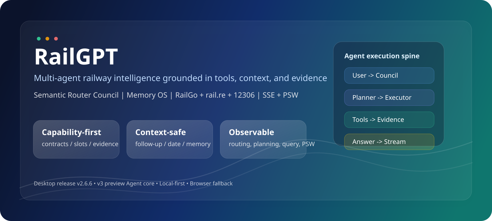
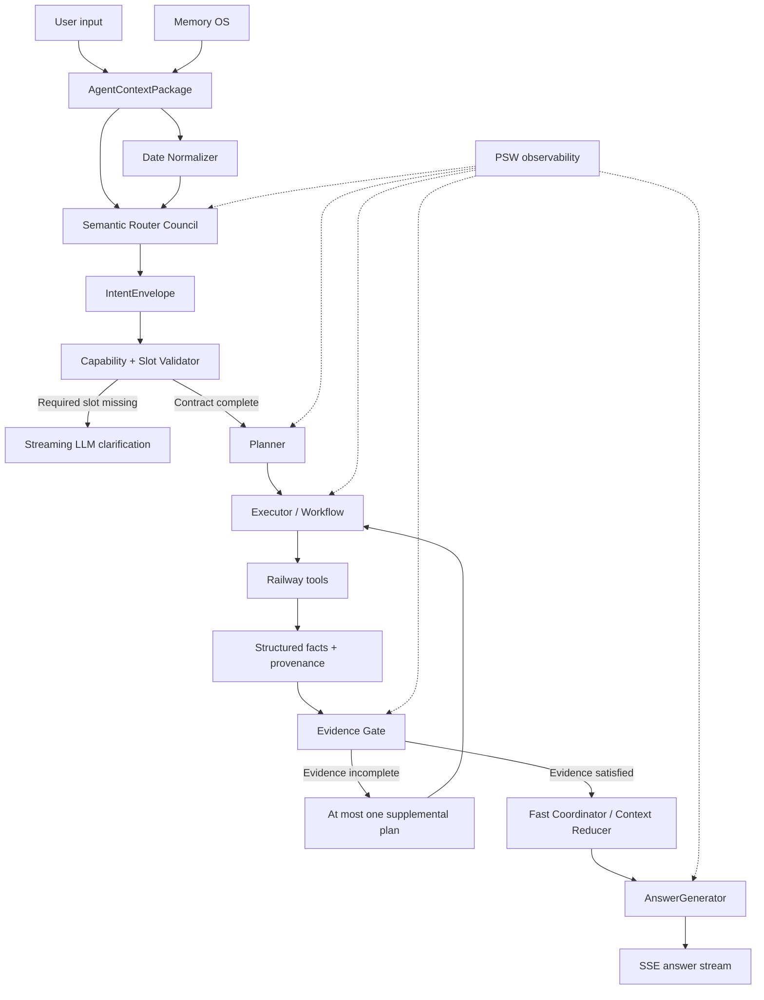
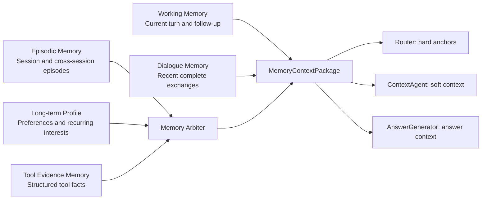

# RailGPT

<p align="center">
  
</p>

<p align="center">
  <a href="./README.md">简体中文</a> ·
  <strong>English</strong> ·
  <a href="https://github.com/EasonWheng/RailGPT/releases/tag/v2.6.6">Download v2.6.6</a> ·
  <a href="https://github.com/EasonWheng/RailGPT/issues">Issues</a>
</p>

<p align="center">
  <strong>A local-first, multi-agent railway assistant grounded in structured tools and verifiable evidence.</strong>
</p>

RailGPT is not a chatbot that guesses railway facts from model pretraining. It is a local desktop Agent system that combines semantic routing, railway-specific tools, context engineering, layered memory, cache-aware networking, evidence validation, streaming generation, and an observable execution state machine.

When a user asks about a train path, stop history, rolling-stock assignment, station-to-station services, live ticket availability, current delay status, station boards, or platform information, RailGPT first selects a registered capability contract. It then calls the smallest appropriate set of tools and allows the LLM to write an answer only from the collected evidence.

Questions about railway principles, history, culture, travel ideas, creative writing, or ordinary conversation follow a contextual chat path instead. They are not forced into an origin-destination or date form.

> [!IMPORTANT]
> RailGPT is an information and railway-analysis application. It does not provide automatic ticket purchasing, ticket sniping, repeated ticket polling, risk-control bypasses, bulk scraping, or other abusive ticketing behavior.

> [!NOTE]
> The latest downloadable desktop release is **v2.6.6**. The `main` branch contains a substantially upgraded **v3 preview / release-candidate Agent core**. The preview label describes the generation of the routing, context, memory, and evidence architecture. It does not mean that a `v3.0.0` installer has already been published.

## Table of Contents

- [Project Status](#project-status)
- [What Changed During the Last Three Months](#what-changed-during-the-last-three-months)
- [Design Principles](#design-principles)
- [Current Capabilities](#current-capabilities)
- [Capability Contracts and Missing-Slot Handling](#capability-contracts-and-missing-slot-handling)
- [Agent Architecture](#agent-architecture)
- [Context and Date Engineering](#context-and-date-engineering)
- [Memory OS](#memory-os)
- [Data Providers, Network Protection, and Caching](#data-providers-network-protection-and-caching)
- [Models and Runtime Modes](#models-and-runtime-modes)
- [Fast-Mode Fact Compression](#fast-mode-fact-compression)
- [Desktop and Frontend Experience](#desktop-and-frontend-experience)
- [Privacy and Security](#privacy-and-security)
- [Installation and Usage](#installation-and-usage)
- [Development and Testing](#development-and-testing)
- [Repository Layout](#repository-layout)
- [Current Limitations](#current-limitations)
- [Version Policy and Roadmap](#version-policy-and-roadmap)
- [Contributing](#contributing)
- [Acknowledgements](#acknowledgements)

## Project Status

| Area | Current State |
| --- | --- |
| Downloadable desktop release | `v2.6.6` |
| Architecture on `main` | `v3 preview / RC` |
| Primary platform | Windows 10/11 x64 |
| Desktop stack | Flask + HTML/CSS/JavaScript + pywebview |
| Browser fallback | Automatically used when pywebview cannot start |
| Default local address | `127.0.0.1:5033`, with automatic port conflict avoidance |
| LLM provider | DeepSeek through an OpenAI-compatible API |
| Agent modes | `FAST-GO`, `FAST-PLUS`, and `DEEP` |
| Local storage | SQLite + JSON/JSONL + local files |
| API-key protection | Windows DPAPI in the current user's AppData directory |
| Chat delivery | SSE text streaming plus a separate Thinking/PSW observer stream |
| Latest regression baseline | 382 unit tests passing |
| Intended deployment | Local, single-user desktop research and railway consultation |

The current execution loop is:

```text
User input
  -> Context construction
  -> Date normalization
  -> Multi-agent semantic routing
  -> Capability and slot validation
  -> Planning and tool execution
  -> Evidence validation
  -> Fact compression
  -> Streaming LLM answer
  -> Conversation and memory persistence
```

RailGPT is now well beyond its original prototype stage. The project has a real desktop shell, a persistent settings system, a structured tool layer, local databases, an observable state machine, replayable regression cases, and explicit safeguards against using the wrong type of railway evidence.

## What Changed During the Last Three Months

### Routing moved from keyword flags to semantic collaboration

Earlier versions relied heavily on local `_looks_like_*` helpers, keyword flags, and flattened recent-entity pools. These shortcuts were fast, but they frequently failed on follow-up language such as:

- “What about that one?”
- “Why are there so many?”
- “Yes, exactly.”
- “Continue writing.”
- “Is that because the Beijing bureau gets higher priority?”

The current frontend routing layer is centered on a **Semantic Router Council**:

- a continuation agent identifies follow-up and continuation intent;
- a tool-intent agent selects professional railway capabilities;
- a chat-knowledge agent identifies knowledge, travel, social, meta, and creative turns;
- a compact arbiter resolves disagreement or low-confidence votes.

LLMs now perform the main semantic classification. Deterministic code is retained for contract validation, explicit-input priority, safe fallbacks, and evidence boundaries rather than as a giant intent classifier.

### Tool knowledge moved into a shared capability registry

Tool descriptions used to be distributed among prompts, router branches, planner code, and answer-generation rules. The current project uses an MCP-style `ToolCapabilityRegistry`.

Each capability declares:

- intent family;
- required slots;
- optional slots;
- defaults;
- temporal scope;
- required evidence;
- execution workflow;
- cost tier;
- maximum fan-out;
- availability;
- examples and exclusion rules.

The registry is shared by the Router, Planner, Executor, Evidence Gate, and AnswerGenerator. This reduces a major source of drift where one component believed a tool could answer something that another component considered unsupported.

### Context is now built once and distributed by role

All major agents consume a structured `AgentContextPackage`. Individual components no longer improvise with patterns such as `recent_messages[-2:]`.

The package provides:

- the latest user message;
- recent complete dialogue turns;
- a compact dialogue excerpt;
- the last assistant response;
- follow-up contracts;
- explicit entities;
- working anchors;
- date resolution;
- memory candidates;
- a context fingerprint.

Each agent receives a role-specific view and budget. The Router sees intent-relevant context, the Date Normalizer sees date-relevant context, and the AnswerGenerator sees the chosen intent plus validated evidence.

### Date handling became a dedicated Agent responsibility

Date mistakes were one of the most serious historical failure modes. A user could explicitly ask for May 5, while a context rewrite silently changed the query to “today.”

RailGPT now uses a dedicated Date Normalizer with a strict priority policy:

1. an explicit date in the latest user message;
2. a relative date in the latest user message;
3. a previous date only when the user clearly refers back to it;
4. a default date only when the selected capability permits one.

Complex date interpretation in `FAST-PLUS` and `DEEP` is LLM-only. Deterministic code validates the returned structure and protects explicit user dates from being overwritten.

### Memory became a layered Memory OS

The previous memory system centered on anchors, recent entities, episodic retrieval, and long-term frequency buckets. That design could allow an old route or an assistant-generated claim to contaminate later routing.

The current Memory OS separates:

- Working Memory;
- Dialogue Memory;
- Episodic Memory;
- Long-term Profile Memory;
- Tool Evidence Memory.

Retrieval produces candidates first. A Memory Arbiter then decides whether each candidate is suitable as a hard anchor, soft context, answer context, or should be ignored.

Long-term memory is now preference-oriented and soft-only. It cannot directly inject a train, route, or date into an executable query.

### External access became more restrained and observable

RailGPT now:

- supports RailGo v1 and v2 through a compatible client layer;
- identifies itself in RailGo requests;
- generates a local anonymous installation UUID;
- checks local databases and certificates before network access;
- uses bounded connection pools and low-frequency access;
- applies truncated binary exponential backoff;
- combines concurrent requests for the same key through single-flight locks;
- caches live operational data according to the semantics of each endpoint.

### The application became a configurable desktop product

API keys are no longer stored in source configuration. Users configure them from the Settings interface.

The desktop application now includes:

- current-user DPAPI encryption;
- separate primary and thinker keys;
- pywebview-first startup;
- automatic browser fallback;
- default port `5033`;
- automatic free-port allocation;
- native Markdown export in pywebview;
- HTTP-download export in browser mode;
- light, dark, high-contrast, and colorful themes.

## Design Principles

### 1. Tool evidence before model confidence

If a question matches a registered professional tool contract, RailGPT should call the tool before generating a factual answer.

Examples:

- “What trainset has G20 used recently?” should call assignment history.
- “Did the earliest G1 stop only at Nanjing South?” should call stop-history analysis.
- “Verify through 12306 whether business class is sold out.” should call live ticket inventory.
- “Is G813 delayed today?” should call current delay data.
- “Which Beijing station is on the Beijing-Guangzhou high-speed railway?” is railway knowledge and should not trigger a ticket-query missing-slot form.

### 2. Every capability owns its own slot policy

RailGPT does not use a global “all railway questions require origin and destination” rule.

- Live ticket inventory requires origin, destination, and date.
- Current delay status requires only a train number.
- Origin and destination are optional display scopes for delay results.
- A station board requires a station; direction defaults to departures.
- Check-gate, platform, and exit information requires a train and a station.
- Station-access date defaults to today unless the user specifies another date.
- A combined train overview requires only a train number.
- Knowledge, social, travel, and creative turns do not enter railway-query slot filling.

### 3. Explicit current-turn facts outrank memory

The priority order is:

```text
Latest explicit user input
  > current-turn tool evidence
  > active follow-up contract
  > reliable dialogue context
  > episodic candidates
  > long-term soft profile
  > assistant-generated prose
```

An explicit `2026-05-05`, `G20`, or `Nanjing South` in the latest user message must not be overwritten by an old date, a previous route, or an LLM rewrite.

### 4. A successful tool call is not enough

The returned evidence must match the user's actual intent.

The Evidence Gate prevents substitutions such as:

- using a scheduled path to answer current delay status;
- using timetable data to answer live ticket availability;
- using a station-to-station list to answer stop-history changes;
- using generic trainset knowledge to answer assignment history;
- inventing a “benchmark” rating without `s2s_benchmark` evidence.

### 5. Execution should be observable

RailGPT exposes PSW states for:

- memory recall, curation, and arbitration;
- routing and capability selection;
- planning and workflow steps;
- querying and in-flight requests;
- cache hit, miss, and expiry;
- retry and backoff;
- evidence mismatch;
- fast reduction, merging, and RAG;
- generation, completion, and errors.

The Observer Panel helps users understand why the application is waiting. It also lets maintainers distinguish routing latency from network latency, tool latency, compression latency, and final-generation latency.

## Current Capabilities

### Train and trainset analysis

| Capability | Example Question | Tool or Workflow |
| --- | --- | --- |
| Recent assignment for one train | What has G20 used during the last few days? | `train` |
| Recent duties of one EMU set | What services has CR400BF-5033 worked recently? | `emu` |
| Multi-train smart-EMU analysis | Analyze smart-EMU use on G7, G20, and G33 | `smartemu_analysis` |
| Combined train overview | Give me a detailed overview of G311 | `train_overview = path_detail + train` |
| Smart-EMU search on a route | Which Shanghai-Hongqiao to Beijing-South trains often use AFZ sets? | `route_smartemu_search = s2s + smartemu` |

Train-to-EMU assignment history and concrete trainset duty history primarily come from the `rail.re` data path.

Assignment evidence must be described carefully:

- “recent records” is acceptable;
- “most frequently observed” is acceptable;
- “the latest recorded set” is acceptable;
- “today's final operational assignment” is not acceptable unless the available evidence actually supports it.

### Paths, schedules, and stop history

| Capability | Purpose |
| --- | --- |
| `path_detail` | Current or dated origin, destination, stops, and scheduled times |
| `path_future` | Train path for an explicit future date |
| `path_past` | Train path for an explicit historical date |
| `path_stopcheck` | Multi-train by multi-station stop matrix and historical stop validation |

Typical questions:

- “What is the complete route of G20?”
- “Did the earliest G1 stop only at Nanjing South?”
- “When did G1 begin stopping at Jinan West or Tianjin South?”
- “Where do G71 and G73 actually terminate, and how do their stops differ?”

`path_detail` is scheduled-path evidence. It must not be used as live delay, platform, or ticket evidence.

### Station-to-station search and filtering

| Capability | Purpose |
| --- | --- |
| `station_to_station_mini` | Compact recommendation-oriented service list |
| `station_to_station_detail` | Full listing when the user explicitly asks for all results |
| `station_to_station_future` | OD services for an explicit future date |
| `station_to_station_past` | OD services for a historical date |
| `s2s_benchmark` | Tool-rated fastest or benchmark candidates |
| `s2s_timeband_dep` | Filter by departure time band |
| `s2s_timeband_arr` | Filter by arrival time band |
| `s2s_regular_only` | Keep regular scheduled services |
| `s2s_temporary_only` | Keep temporary passenger services |
| `s2s_bureau_filter` | Filter by operating railway bureau/group |
| `route_train_benchmark` | Verify whether a specified train is a tool-rated benchmark candidate on an OD |

RailGo timetable data has quarterly characteristics. A query for one valid operating date may provide useful timetable evidence for the current timetable period. RailGPT preserves its date-attempt, certificate, and local-database logic to balance:

- regular scheduled trains;
- temporary suspensions;
- temporary passenger services;
- low external request volume.

### Official 12306 passenger information

| Capability | Required Input | Purpose |
| --- | --- | --- |
| `left_ticket_s2s` | Origin, destination, date | Official live ticket availability, optionally limited to specified trains |
| `transfer_12306` | Origin, destination, date | Two-leg transfer options, optionally with a requested transfer station |

The 12306 path includes:

- SQLite query caching;
- certificate-state caching;
- single-flight request merging;
- a bounded live-query window;
- controlled fallback behavior;
- protection against repeated ticket polling.

RailGPT displays information and options. It does not purchase tickets.

### Stations, telecodes, and explicit fuzzy lookup

| Capability | Example |
| --- | --- |
| `telecode` | What is the telecode for Nanjing South? |
| `name` | Which station is NKH? |
| `station` | Which railway bureau and city does Nanjing South belong to? |
| `station_preselect` | I only remember part of the station name; find candidates |
| `train_preselect` | I only remember the beginning of the train number |
| `random_train` | Randomly choose a train for me to study |

Exact station-name and telecode conversion uses the bundled station dictionary first. Expensive fuzzy preselection endpoints are reserved for explicit discovery requests rather than every mention of a station.

### RailGo v2 live operations

| Capability | Required Input | Defaults | Local Cache |
| --- | --- | --- | --- |
| `train_delay` | Train number | OD or station is optional | 15 minutes, capped at Beijing midnight |
| `train_station_access` | Train number and station | Today and departure direction | Valid until the next Beijing midnight |
| `station_board` | Station | Departure board | 5 minutes, capped at Beijing midnight |

#### Delay workflow

1. With only a train number, RailGPT may fetch the scheduled path to establish the station order and then query current delay status.
2. With a user-provided OD, the RailGo request still uses the train number; RailGPT filters the all-station result locally.
3. A current-status endpoint cannot answer historical or future delay questions.
4. A scheduled route, scheduled time, or absence of a warning cannot prove that a train is currently on time.
5. If live evidence expires and refresh fails, stale data is not presented as current status.

#### Station-access workflow

The user must provide:

- a complete train number;
- the specific station whose gate, platform, or exit information is needed.

The date defaults to the current Beijing date. Direction defaults to departure. Explicit user input always overrides these defaults.

#### Station-board workflow

A station is required. When direction is omitted, RailGPT uses the departure board. A request for arrivals switches the direction rather than creating a new global interpretation rule.

### Railway knowledge, travel, and creative conversation

RailGPT also handles non-tool dialogue:

- railway engineering principles;
- signalling and train-control concepts;
- turnout and route-design discussion;
- tunnel pressure and passenger comfort;
- railway history and culture;
- enthusiast discussion and trainset knowledge;
- city travel ideas;
- creative continuation based on the previous answer;
- short follow-ups such as “why?”, “what about it?”, “continue”, or “yes.”

These turns should be routed as contextual chat when no dynamic tool evidence is required.

## Capability Contracts and Missing-Slot Handling

The capability registry is implemented in `agent/capabilities.py`.

Current registry version:

```text
2026-07-mcp-capability-manifest-v5
```

A capability contract can include:

```json
{
  "object": "train_delay",
  "intent_family": "live_delay",
  "required_slots": ["train"],
  "optional_slots": ["dep", "arr", "station"],
  "temporal_scope": "current_only",
  "required_evidence": ["train_delay"],
  "workflow": ["path_detail", "train_delay"],
  "execution_strategy": "adaptive",
  "availability": "available"
}
```

The Router selects a semantic capability first. The Slot Validator then checks only the required fields for that capability.

The deterministic layer enforces:

- only genuinely missing required slots are requested;
- optional slots never block execution;
- defaults are applied only when declared by the selected capability;
- explicit user input overrides defaults;
- unknown or disabled capabilities cannot execute;
- one capability cannot pretend to provide another capability's evidence.

The wording of a clarification is generated naturally by an LLM from the structured contract. This avoids a single repetitive template such as “please provide origin, destination, or train number” for every unrelated question.

## Agent Architecture



### Semantic Router Council

The frontend semantic council includes:

- `continuation_agent`;
- `tool_intent_agent`;
- `chat_knowledge_agent`;
- a consensus layer and compact arbiter.

The agents share the same structured context contract but receive different role-focused views.

If the Council times out or returns invalid JSON, the fallback is intentionally constrained. For example:

- a delay question cannot silently degrade into `path_detail`;
- a knowledge question cannot be converted into a ticket query;
- a missing train number cannot be invented;
- an old route cannot be reused without reliable contextual reference.

### IntentEnvelope

The Router emits a structured envelope instead of only a task list:

```json
{
  "intent_family": "train_overview",
  "selected_capability": "train_overview",
  "grounded_slots": {
    "train": "G311"
  },
  "missing_slots": [],
  "required_evidence": ["path_detail", "train"],
  "workflow": ["path_detail", "train"],
  "execution_strategy": "parallel",
  "confidence": 96,
  "context_fingerprint": "..."
}
```

This envelope follows the request through planning, execution, evidence validation, and final generation.

### Planner and Executor

The Planner converts a capability into:

- one tool call;
- a bounded parallel workflow;
- an adaptive workflow;
- or a clarification request.

The Executor provides:

- controlled thread-pool concurrency;
- duplicate-query detection;
- explicit in-flight tracking;
- exception isolation;
- query-level observability.

### Evidence Gate

The Evidence Gate compares:

- the selected capability;
- the declared required evidence;
- the tools that actually completed;
- the facts that were returned.

If a necessary tool has not yet been executed, RailGPT may plan one additional round. If the correct evidence remains unavailable, the answer must state the limitation instead of filling the gap with generic railway knowledge.

## Context and Date Engineering

### AgentContextPackage

The shared context package includes:

- `latest_user_text`;
- `dialogue_history`;
- `dialogue_excerpt`;
- `last_assistant_message`;
- `has_recent_substantive_answer`;
- `followup_contract`;
- `explicit_entities`;
- `working_anchors`;
- `memory_context_package`;
- `date_resolution`;
- `context_fingerprint`.

Role-specific views reduce both context loss and token duplication:

- **Router view:** latest turn, recent complete exchanges, reliable hard slots, compact capability catalog.
- **ContextAgent view:** omitted references, follow-up contract, and safe soft context.
- **DateAgent view:** current Beijing date, date-bearing dialogue, and candidate date anchors.
- **AnswerGenerator view:** selected intent, relevant dialogue, and validated evidence.

### Mode budgets

| Mode | Recent Message Limit | Character Budget | Goal |
| --- | ---: | ---: | --- |
| `FAST-GO` | 8 | 6,000 | Preserve recent complete turns while minimizing latency |
| `FAST-PLUS` | 24 | 12,000 | Better follow-up, mixed-intent, and complex-date handling |
| `DEEP` | 80 | 24,000 | Larger analytical and long-session context |

The budgeter avoids simultaneously injecting:

- full conversation history;
- duplicate excerpts;
- repeated capability descriptions;
- raw memory text;
- raw tool JSON;
- provider metadata.

### ContextAgent responsibility

The ContextAgent is a reference resolver, not the only understanding component.

It handles expressions such as:

- “this train”;
- “those services”;
- “that date”;
- “the one you recommended”;
- “what about it?”;
- “continue from there.”

It may fill omitted references from reliable recent context, but it does not choose the final tool and may not overwrite explicit current-turn entities.

### Date Normalizer contract

The Date Normalizer returns a structured result containing:

- whether a date exists;
- the normalized `YYYY-MM-DD` value;
- the source of the date;
- the original date span;
- whether the date is contextual;
- confidence;
- a short reason.

The safety layer verifies:

- date syntax and calendar validity;
- consistency with the latest explicit user span;
- confidence requirements;
- whether contextual reuse is actually justified.

## Memory OS



### Memory layers

#### Working Memory

Contains:

- the current user turn;
- current routing state;
- pending clarification;
- current follow-up contract;
- date resolution;
- in-progress task state.

It exists only for the active conversation.

#### Dialogue Memory

Preserves recent complete user-assistant exchanges and recent tasks/facts. Its primary purpose is conversational continuity.

#### Episodic Memory

Compresses turns into retrievable episodes. Episodic matches are candidates, not automatically executable slots.

#### Long-term Profile Memory

Stores stable user preferences and recurring interests. It is always soft-only.

It must not store a live operational fact such as:

- today's trainset assignment;
- current ticket inventory;
- current platform;
- current delay state.

#### Tool Evidence Memory

Stores structured tool evidence with:

- query object;
- identifier;
- date;
- source type;
- timestamp;
- expiration information.

Tool evidence may support a hard anchor only while its scope and freshness remain valid.

### MemoryPacket schema

The unified packet includes:

- `id`;
- `schema_version`;
- `scope`;
- `kind`;
- `source`;
- `text`;
- `summary_l0`;
- `overview_l1`;
- `entities`;
- `slots`;
- `confidence`;
- `provenance`;
- `created_at`;
- `last_seen`;
- `expires_at`;
- `tags`.

### Anti-contamination rules

- Only `explicit_user`, `tool_fact`, and `followup_contract` can become hard-slot candidates.
- `assistant_statement` is marked soft-only and no-hard-anchor by default.
- Long-term profile entries can never directly fill train, route, or date.
- Explicit current-turn input always outranks memory.
- Media URLs, attachment paths, provider endpoints, and full geometry do not enter long-term memory.
- Legacy memory is migrated as soft context rather than trusted hard state.

### Importance scoring

RailGPT does not write every turn into long-term memory.

A profile candidate must show meaningful importance, such as:

- an explicit preference;
- a repeated, user-initiated interest;
- a stable workflow habit;
- enough repeated evidence to pass the importance threshold.

Repeated interest is labeled `recurring_interest`, not “favorite.” Only an explicit preference can become `explicit_preference`.

## Data Providers, Network Protection, and Caching

The application header lists the available providers. This avoids repeatedly spending final-answer context on source boilerplate while still making the ecosystem visible.

| Provider | Main Responsibility |
| --- | --- |
| [RailGo](https://railgo.dev/) | Timetables, train/station master data, station-to-station services, current delay, station boards, and station access |
| [rail.re](https://rail.re/) | Trainset assignment history and concrete EMU duty records |
| [China Railway 12306](https://www.12306.cn/) | Official live ticket inventory and transfer options |
| Bundled station dictionary | Chinese names, telecodes, cities, and hub mappings |
| Local SQLite stores | Reusable timetable, ticket, certificate, and operational evidence |

### Provider boundaries

RailGPT does not describe every fact as “from RailGo.”

- trainset assignment evidence may come from `rail.re`;
- live ticket evidence comes from 12306;
- timetable and live operational facts may come from RailGo;
- exact station conversion may be purely local.

Provider metadata remains in structured provenance for debugging and auditing. The final answer receives only the source detail needed to explain freshness or uncertainty.

### RailGo v1/v2 compatibility

The strategy is local-first:

1. validate local cached evidence and certificates;
2. use valid local data when possible;
3. access the network only when the local evidence is missing or expired;
4. prefer the appropriate v2 capability for current APIs;
5. retain v1 when it still returns useful valid data;
6. distinguish semantic failures from transient failures.

Examples:

- `400` and `404` are not treated like timeouts;
- contract-shape failures are not silently cached;
- `429` and `5xx` use bounded retry behavior;
- a valid local certificate can avoid all network calls.

### RailGo request identity

RailGo requests include headers such as:

```text
User-Agent: RailGPT/2.6.6 (+https://github.com/EasonWheng/RailGPT)
X-Client-Name: RailGPT
X-Client-Version: 2.6.6
X-Data-Purpose: interactive railway query
X-RailGPT-Installation-ID: <anonymous local UUID>
```

The installation UUID does not contain:

- an API key;
- a conversation ID;
- user query text;
- a hostname;
- a device fingerprint;
- an account identifier.

### Shared network protection

The RailGo and railway HTTP layers use:

- a shared `requests.Session`;
- a two-connection pool;
- a global low-frequency interval;
- bounded timeouts;
- truncated binary exponential backoff;
- no uncontrolled polling;
- single-flight request merging.

### Operational cache policies

The `railgo_operational_cache` SQLite table stores:

- object;
- cache key;
- payload JSON;
- payload hash;
- service date;
- fetched time;
- expiration time;
- source metadata;
- schema version.

Validation includes:

- schema compatibility;
- object and key matching;
- payload type;
- payload hash;
- successful response contract;
- Beijing-time expiration.

Cache policies:

| Object | Cache Key | Validity |
| --- | --- | --- |
| `station_board` | station telecode + direction | 5 minutes, capped at Beijing midnight |
| `train_delay` | normalized train number | 15 minutes, capped at Beijing midnight |
| `train_station_access` | train + station telecode + query date + direction | Until the next Beijing midnight |

A valid empty result is cached. Expired live data is retained for diagnostics but is not passed to the AnswerGenerator as current evidence when refresh fails.

### 12306 protection

The 12306 layer uses:

- a separate SQLite store;
- certificate validity checks;
- query-level TTLs;
- WAL mode;
- per-key in-flight locks;
- a bounded live-query allowance;
- controlled stale fallback;
- no automatic purchase workflow.

## Models and Runtime Modes

| Mode | Model | Thinking | Intended Use |
| --- | --- | --- | --- |
| `FAST-GO` | `deepseek-v4-flash` | disabled | Direct, low-latency requests |
| `FAST-PLUS` | `deepseek-v4-flash` | enabled | Follow-up, complex dates, and mixed intent |
| `DEEP` | `deepseek-v4-pro` | enabled | Heavy analysis and conservative reasoning |

DeepSeek is accessed through the OpenAI-compatible `/chat/completions` API.

Thinking-enabled requests use:

```python
reasoning_effort="high"
extra_body={"thinking": {"type": "enabled"}}
```

`reasoning_content` is handled separately from final `content`. The chat bubble streams final content, while thinking and PSW information appear in the observer channel.

### Primary and thinker API keys

The Settings page supports:

- a primary key for the main Router and AnswerGenerator path;
- an optional thinker key for thinking and high-level auxiliary calls.

When the thinker key is omitted, the application falls back to the primary key.

The LLM client watches the settings version and lazily refreshes its OpenAI client. New settings apply to subsequent requests without restarting the application.

## Fast-Mode Fact Compression

Fast mode does not discard the complete tool result. It controls what is passed into the LLM.

The pipeline:

1. each tool creates a deterministic, object-specific fast view;
2. facts are split into compact chunks;
3. chunks are packed into up to six balanced lanes;
4. deterministic reduction skips lane-level LLM calls when possible;
5. semantic extraction runs in parallel only when needed;
6. candidates, optional RAG, and the presentation plan are merged;
7. the AnswerGenerator receives a high-signal context.

This architecture is important for railway data mining. The complete evidence remains available in the tool layer, while the LLM receives the parts that matter for the current question.

Dynamic tool-grounded queries normally skip generic knowledge RAG to avoid mixing static railway explanations with current operational evidence.

## Desktop and Frontend Experience

The active application stack is:

```text
Flask backend + HTML/CSS/JavaScript frontend + pywebview desktop shell
```

The old `ui/` directory contains historical Qt-era code. PyQt is not part of the current runtime.

### Startup behavior

1. prepare runtime paths and seeded databases;
2. attempt to bind `127.0.0.1:5033`;
3. allocate a free local port if `5033` is occupied;
4. start Flask;
5. wait for the health check;
6. launch a pywebview desktop window;
7. open the system browser if pywebview initialization fails.

### Current frontend features

- frameless pywebview desktop window;
- Windows window and taskbar icon;
- automatic browser fallback;
- SSE answer streaming;
- Thinking and PSW Observer Panel;
- conversation creation, loading, renaming, deletion, and search;
- Markdown rendering and code highlighting;
- native Markdown export in desktop mode;
- HTTP download fallback in browser mode;
- light, dark, high-contrast, and colorful themes;
- fixed RailGo, rail.re, and 12306 provider bar;
- Settings tabs for Account, API, and About;
- API-unconfigured startup with history and About still available.

### Local HTTP API

| Method | Path | Purpose |
| --- | --- | --- |
| `GET` | `/` | Main frontend |
| `POST` | `/api/chat` | SSE chat stream |
| `POST` | `/api/mode` | Change Agent mode |
| `GET/POST` | `/api/conversations` | List or create conversations |
| `GET/DELETE` | `/api/conversations/<id>` | Read or delete a conversation |
| `POST` | `/api/conversations/<id>/load` | Load a conversation and restore context |
| `PUT` | `/api/conversations/<id>/rename` | Rename a conversation |
| `GET` | `/api/conversations/<id>/export` | Browser Markdown export |
| `GET` | `/api/settings` | Read settings state |
| `PUT/DELETE` | `/api/settings/api` | Save or delete API keys |
| `GET` | `/api/status` | Busy, conversation, and configuration state |
| `GET` | `/api/search` | Search conversation history |
| `GET` | `/api/readme` | Show README content in Settings/About |

## Privacy and Security

### API-key storage

- no default DeepSeek API key is stored in the repository;
- users configure keys through Settings;
- Windows uses current-user DPAPI encryption;
- the encrypted file is stored under the current user's AppData `RailGPT/settings.enc`;
- the frontend displays only masked status;
- key modification is rejected during an active stream to prevent mid-request inconsistency.

### Local data

Local data includes:

- `conversations/` for dialogue history;
- `memory_store/` for memory packets, episodes, and profile indexes;
- `reports/` for local regression reports;
- AppData settings and installation identity;
- SQLite runtime data and caches.

`conversations/`, `memory_store/`, and `reports/` are excluded by `.gitignore`.

The tracked `rail_store.db` and `rail12306.db` files are seeded databases intended to improve first-run usability. Runtime changes should not be committed casually.

### Prompt and memory isolation

Provider URLs, endpoint paths, full source JSON, media locators, and other diagnostic metadata remain in structured provenance.

They are excluded from:

- normal final-answer prompts;
- long-term user profiles;
- hard route, train, and date anchors.

## Installation and Usage

### Option 1: Download the desktop release

Open:

**[RailGPT v2.6.6 Release](https://github.com/EasonWheng/RailGPT/releases/tag/v2.6.6)**

The Setup package is recommended for ordinary Windows use. The portable archive is suitable for a no-install trial.

After first launch:

1. open `Settings`;
2. select the `API` tab;
3. choose DeepSeek;
4. enter the primary API key;
5. optionally enter a thinker API key;
6. return to the chat interface.

API keys saved on one computer are not embedded into the installer and will not appear on another computer.

### Option 2: Run from source

Recommended environment:

- Windows 10/11 x64;
- Python 3.12;
- Conda or a virtual environment;
- a DeepSeek API key.

```powershell
git clone https://github.com/EasonWheng/RailGPT.git
cd RailGPT

conda create -n AIagent python=3.12
conda activate AIagent

pip install -r requirements.txt
python main.py
```

### Starting without an API key

The application can start without a configured key.

Users can still:

- view conversation history;
- search, rename, delete, and export conversations;
- read the About documentation;
- configure an API provider.

The message input remains locked until a primary key is available.

## Development and Testing

### Install development dependencies

```powershell
pip install -r requirements-dev.txt
```

`requirements-dev.txt` adds PyInstaller to the runtime dependencies.

### Run the unit-test suite

```powershell
python -m unittest discover -v
```

Latest full local regression:

```text
Ran 382 tests in 80.819s
OK
```

Coverage includes:

- Semantic Router Council and fallback behavior;
- capability contracts, slot validation, and Evidence Gate;
- Date Normalizer and contextual follow-up;
- MemoryPacket, retrieval, importance scoring, and anti-contamination;
- Planner, Executor, fast views, and Fast Coordinator;
- RailGo v1/v2 clients, caches, and fallback;
- 12306 query protection;
- Flask settings, SSE, web assets, and desktop startup;
- port conflict handling, browser fallback, and export.

### Replay historical conversations

The historical replay tool evaluates Router behavior without executing railway tools:

```powershell
python scripts/historical_conversation_eval.py `
  --mode fast-go `
  --workers 2 `
  --judge
```

Latest focused replay:

```text
Conversations: 5
User turns: 29
Structural failures: 0
Semantic verdicts: pass 29
```

### Railway enthusiast 50-question suite

`火车迷50问.txt` contains real enthusiast-style questions. It is used to test:

- tool selection;
- hallucination resistance;
- date interpretation;
- origin-destination boundaries;
- follow-up continuity.

```powershell
python scripts/live_railfan50_eval.py --mode fast-go --limit 50
```

> [!CAUTION]
> Live evaluation consumes LLM tokens and may access RailGo, rail.re, and 12306. Run small, low-frequency batches. Do not use the suite as an external API stress test.

### Packaging

Build the portable directory with:

```powershell
pyinstaller RailGPTv2_0.spec --noconfirm
```

The spec includes:

- Flask templates and static resources;
- release metadata and icons;
- seeded SQLite databases;
- station dictionaries;
- pywebview;
- sentence-transformers, transformers, and relevant runtime resources.

The formal Windows installer is produced with Inno Setup.

## Repository Layout

```text
RailGPT/
├─ agent/
│  ├─ router.py               # Semantic Router Council
│  ├─ capabilities.py         # Capability registry and IntentEnvelope
│  ├─ context_agent.py        # Omitted-reference and follow-up resolution
│  ├─ date_normalizer.py      # Dedicated date Agent
│  ├─ planner.py              # Capability-to-plan conversion
│  ├─ executor.py             # Controlled concurrent execution
│  ├─ app.py                  # Agent loop and Evidence Gate
│  ├─ fast_mode.py            # Fast fact compression
│  ├─ fast_tool_views.py      # Tool-specific compact views
│  └─ answer_generator.py     # Final and clarification streaming
├─ memory/
│  ├─ session.py              # AgentContextPackage and context budgets
│  ├─ orchestrator.py         # Retrieval and arbitration
│  ├─ curator.py              # Typed memory writes
│  ├─ packets.py              # MemoryPacket schema
│  ├─ profile_index.py        # Importance scoring and soft profile
│  └─ conversation_store.py   # Conversation persistence and restore
├─ tools/rail/
│  ├─ railgo_client.py        # RailGo v1/v2 client
│  ├─ operational_cache.py    # Live operational cache
│  ├─ rail_store.py           # Railway SQLite store
│  ├─ rail_12306_store.py     # 12306 cache and rate protection
│  ├─ path_query.py           # Paths and stop history
│  ├─ s2s_query.py            # Station-to-station queries and filters
│  ├─ train_query.py          # Train and EMU assignment history
│  ├─ smartemu_analysis.py    # Multi-train assignment analysis
│  ├─ transfer_12306.py       # 12306 transfer search
│  └─ station_dict.py         # Station names and telecodes
├─ knowledge/                 # Static railway knowledge RAG
├─ llm/                       # DeepSeek/OpenAI-compatible client
├─ static/                    # Frontend CSS, JavaScript, and vendors
├─ templates/                 # Flask HTML
├─ scripts/                   # Historical and 50-question evaluation
├─ main.py                    # Desktop-first launcher
├─ web_app.py                 # Flask API and SSE
├─ window_api.py              # pywebview native bridge
├─ app_settings.py            # DPAPI-protected API settings
├─ app_runtime.py             # Runtime paths and release metadata
├─ release_metadata.json      # Single release metadata source
├─ rail_store.db              # Seeded railway database
└─ rail12306.db               # Seeded 12306 database
```

## Current Limitations

RailGPT has become significantly more capable, but it is not a cloud-scale production service and cannot guarantee coverage for every railway question.

### Known limitations

- The application is local and single-user; account sync and multi-tenant isolation are not implemented.
- Current-user DPAPI makes the full desktop experience Windows-oriented.
- DeepSeek is the only enabled provider, although the internal client uses an OpenAI-compatible request format.
- External-provider uptime, coverage, and refresh schedules are outside RailGPT's control.
- Historical trainset assignments are not final daily dispatch orders.
- Delay capability covers current status, not historical or future delay.
- `coach_layout` and `train_route_map` code assets remain in the repository, but their capabilities are currently disabled while the product experience is redesigned.
- The `ui/` directory is historical Qt code and is not an active dependency.
- Very long pasted text, rare slang, abrupt topic switching, and uncommon technical terminology remain important regression areas.
- The v3 preview requires more real-world conversation testing before a formal `v3.0.0` release.

### Explicitly unsupported behavior

- automatic ticket purchasing;
- ticket sniping or wait-list submission;
- persistent ticket or delay polling;
- access to internal railway dispatch instructions;
- presenting historical assignments as confirmed current trainsets;
- inventing live status when a real-time tool fails;
- high-frequency or bulk access to external APIs.

## Version Policy and Roadmap

### v2.0: the frozen execution foundation

v2.0 established:

- Router -> Planner -> Executor -> Answer;
- multi-round need-more-facts behavior;
- controlled thread-pool concurrency;
- retry, cache, and error isolation;
- PSW observability;
- fact-grounded LLM reasoning.

This foundation remains in the current codebase.

### v2.6.6: current desktop release

v2.6.6 delivered:

- Flask + pywebview desktop packaging;
- Web UI and SSE streaming;
- Settings-based API-key management;
- station-to-station, path, assignment, ticket, and transfer tools;
- Windows Setup and portable delivery;
- baseline context and memory.

### v3 preview: current `main`

The v3 preview focuses on how the Agent reliably uses existing capabilities:

- MCP-style capability registry;
- Semantic Router Council;
- IntentEnvelope;
- per-capability slot validation;
- Evidence Gate;
- AgentContextPackage;
- Date Normalizer;
- Memory OS and importance scoring;
- RailGo v1/v2 compatibility and operational cache;
- historical conversation replay.

### Planned directions

- continue reducing duplicated responsibilities in legacy Router helpers;
- expand real multi-turn regression datasets;
- improve long-text and cross-topic context isolation;
- redesign coach-asset and route-map experiences before re-enabling them;
- extend provider abstraction without exposing unsafe arbitrary URL entry;
- improve release automation, signing, upgrade, and reproducible builds;
- research higher-level railway pattern analysis without weakening evidence boundaries.

## Contributing

RailGPT is released under the MIT License. Contributions from RailGo developers, railway enthusiasts, Agent engineers, and frontend developers are welcome.

Suggested workflow:

1. Fork the repository and create a feature branch from `main`.
2. Read `agent/capabilities.py` before adding a tool.
3. Confirm that the new capability does not duplicate an existing one.
4. Declare required slots, optional slots, temporal scope, evidence, cost, and failure boundaries.
5. Reuse existing cache, identity-header, rate-limit, and retry layers.
6. Do not call external APIs directly from an Agent prompt path.
7. Keep provenance for dynamic facts, but avoid injecting source noise into final prompts.
8. Add Router, Executor, cache, and context tests.
9. Run the complete unit-test suite.
10. Validate real language through historical conversations or the 50-question suite.
11. Explain provider usage and expected call frequency in the pull request.

### Capability review checklist

- Does this capability duplicate an existing contract?
- Is external network access actually necessary?
- Can the local database answer first?
- What slots are required and optional?
- Is the temporal scope current, dated, future, or historical?
- What evidence type is sufficient?
- Could a failure accidentally fall back to the wrong evidence?
- Could the workflow create uncontrolled fan-out?
- How will tool output be compressed for the LLM?
- Could the output contaminate memory?
- Does the implementation expose provider details unnecessarily?

## Acknowledgements

- [RailGo](https://railgo.dev/) for timetable, train/station, and live operational services.
- [rail.re](https://rail.re/) for trainset assignment and duty history.
- [China Railway 12306](https://www.12306.cn/) for official passenger, ticket, and transfer information.
- The RailGPT A14 development team, RailGo developers, and railway enthusiasts who contributed real-world test questions.

RailGPT limits external access, prioritizes local databases, and identifies itself in requests. Data-provider maintainers can contact the project through [GitHub Issues](https://github.com/EasonWheng/RailGPT/issues) if an access policy needs adjustment.

## License

RailGPT is released under the [MIT License](./LICENSE).

---

<p align="center">
  <strong>RailGPT evolves by improving evidence, context, and engineering discipline, not by hiding more guesses inside a larger prompt.</strong>
</p>
